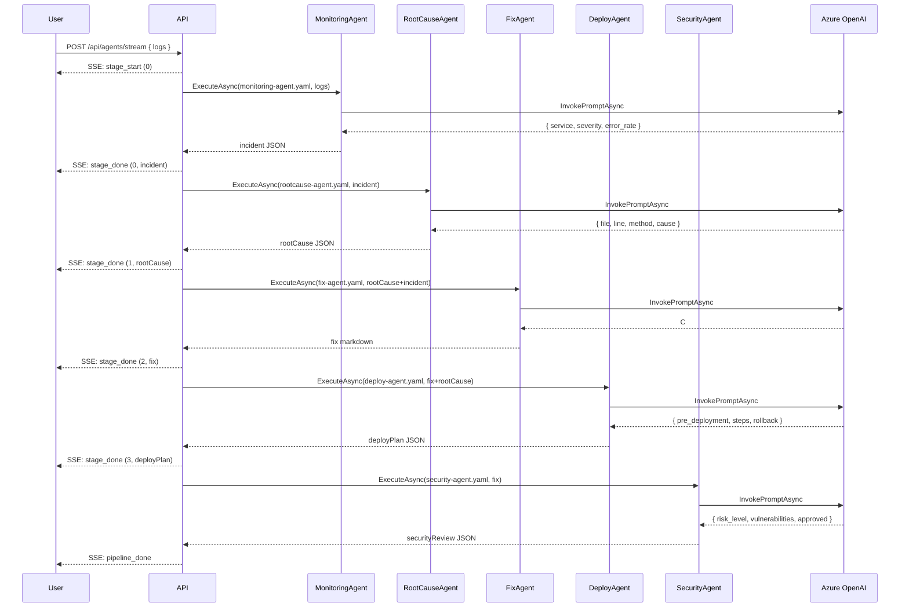
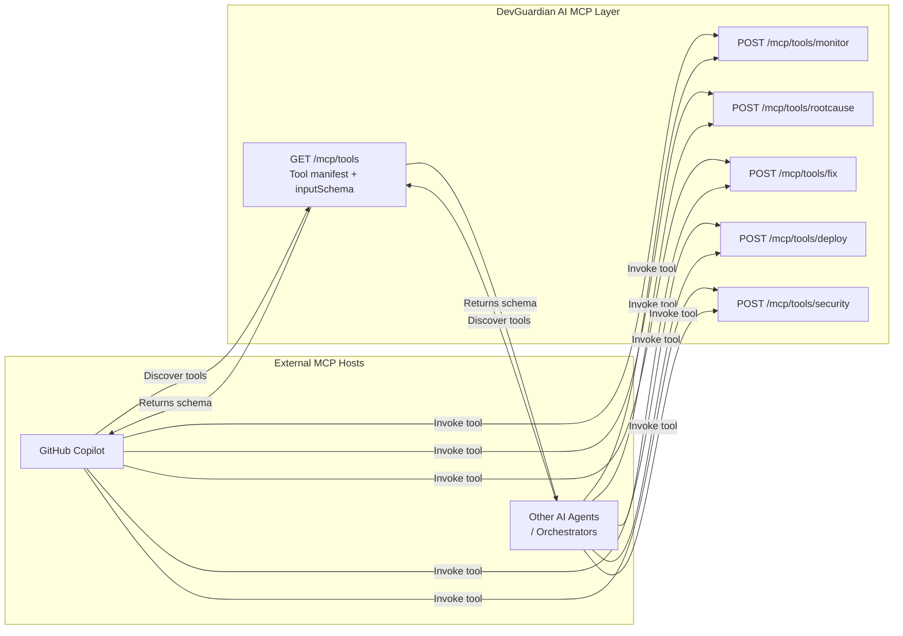

# DevGuardian AI – Architecture Diagrams

## Use in presentations

The diagrams below are in Mermaid format. Render them with:
- [mermaid.live](https://mermaid.live) → paste → export PNG/SVG
- GitHub renders Mermaid in Markdown automatically
- VS Code: install "Markdown Preview Mermaid Support" extension

---

## Diagram 1 – Full System Architecture

```mermaid
flowchart TD
    subgraph Client["Client Layer"]
        UI["🖥️ Web Dashboard\n(index.html + SSE)"]
        MCP_HOST["🤖 MCP Host\n(Copilot / other AI)"]
        SWAGGER["📄 Swagger UI"]
    end

    subgraph API["ASP.NET Core API  (.NET 8)"]
        WF["POST /api/agents/run"]
        STREAM["POST /api/agents/stream\nServer-Sent Events"]
        INVOKE["POST /api/agents/invoke"]
        CAT["GET /api/agents/catalogue"]
        MCP_DISC["GET /mcp/tools"]
        MCP_CALL["POST /mcp/tools/{name}"]
    end

    subgraph Runtime["DevGuardian.AgentRuntime"]
        ENGINE["WorkflowEngine\n5-stage orchestrator"]
        LOADER["SpecLoader\nYAML → AgentSpec (cached)"]
        AR["AgentRuntime\nSemanticKernel executor"]
    end

    subgraph Specs["Agent Specifications (YAML)"]
        S1["📋 monitoring-agent.yaml"]
        S2["🔍 rootcause-agent.yaml"]
        S3["🔧 fix-agent.yaml"]
        S4["🚀 deploy-agent.yaml"]
        S5["🛡️ security-agent.yaml"]
    end

    subgraph Plugins["Semantic Kernel Plugins"]
        P1["DiagnosticsTool\n(log parsing)"]
        P2["GitHubTool\n(PR creation)"]
    end

    subgraph Azure["Azure / AI Backend"]
        AOI["Azure OpenAI\ngpt-4o deployment"]
    end

    UI -->|"POST { logs }"| STREAM
    UI -->|"GET"| MCP_DISC
    MCP_HOST -->|"Tool discovery"| MCP_DISC
    MCP_HOST -->|"Tool invocation"| MCP_CALL
    SWAGGER --> WF & INVOKE & CAT

    WF --> ENGINE
    STREAM --> ENGINE
    MCP_CALL --> AR
    INVOKE --> AR

    ENGINE --> LOADER
    ENGINE --> AR
    LOADER --> S1 & S2 & S3 & S4 & S5

    AR -->|"InvokePromptAsync\nAutoInvokeKernelFunctions"| AOI
    AR --> P1 & P2

    style Specs fill:#1a2040,stroke:#3b82f6
    style Azure fill:#1a2040,stroke:#a855f7
    style Plugins fill:#1a2040,stroke:#22c55e
```

---

## Diagram 2 – Agent Data Flow

---

## Diagram 3 – MCP Integration

